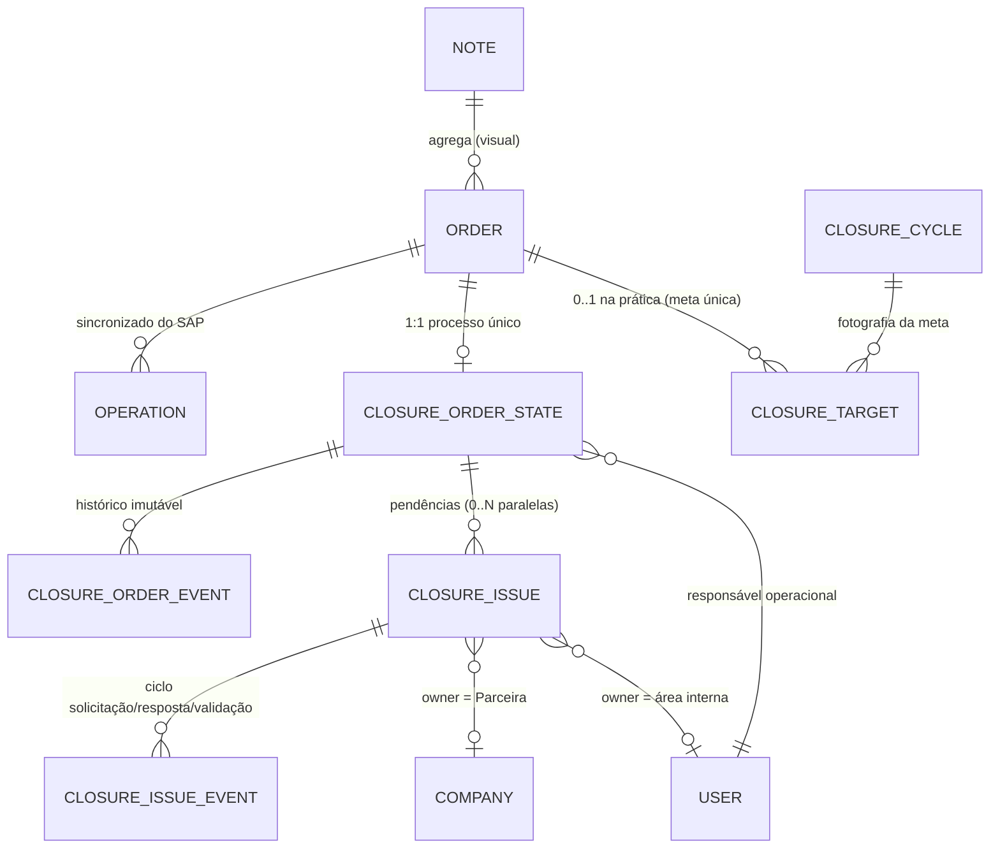

# Planejamento — Módulo de Controle Operacional de Encerramento

> **Status:** documento de planejamento. Nenhum código, migration, model, controller, service, job ou tela foi criado ou alterado nesta etapa. Tudo aqui é proposta para implementação futura, faseada.
>
> **Pergunta que o módulo precisa responder:** *"Qual a situação desta Ordem, onde ela está parada, há quanto tempo, com quem e por quê?"*

---

## Índice

1. [Resumo executivo](#1-resumo-executivo)
2. [Diagnóstico do modelo atual](#2-diagnóstico-do-modelo-atual)
3. [Diagrama conceitual do domínio](#3-diagrama-conceitual-do-domínio)
4. [Fluxo completo do encerramento](#4-fluxo-completo-do-encerramento)
5. [Fluxo da meta mensal](#5-fluxo-da-meta-mensal)
6. [Fluxo do passivo](#6-fluxo-do-passivo)
7. [Fluxo de assunção das Ordens](#7-fluxo-de-assunção-das-ordens)
8. [Fluxo Colaborador x Parceira](#8-fluxo-colaborador-x-parceira)
9. [Proposta de entidades/tabelas](#9-proposta-de-entidadestabelas)
10. [Relacionamentos Eloquent propostos](#10-relacionamentos-eloquent-propostos)
11. [Máquina de estados proposta](#11-máquina-de-estados-proposta)
12. [Estratégia de histórico/auditoria](#12-estratégia-de-históricoauditoria)
13. [Estratégia de detecção de statusSist ENT/ENC](#13-estratégia-de-detecção-de-statussist-entenc)
14. [Estratégia de congelamento da meta](#14-estratégia-de-congelamento-da-meta)
15. [Wireframes textuais das telas](#15-wireframes-textuais-das-telas)
16. [Indicadores que poderão ser gerados](#16-indicadores-que-poderão-ser-gerados)
17. [Pontos de concorrência/transação](#17-pontos-de-concorrênciatransação)
18. [Riscos técnicos](#18-riscos-técnicos)
19. [Regras ainda não conhecidas](#19-regras-ainda-não-conhecidas)
20. [Lista de PENDÊNCIAS DE VALIDAÇÃO](#20-lista-de-pendências-de-validação)
21. [Plano de implementação em fases](#21-plano-de-implementação-em-fases)
22. [Ordem recomendada de desenvolvimento](#22-ordem-recomendada-de-desenvolvimento)
23. [Arquivos/classes atuais afetados por fase](#23-arquivosclasses-atuais-afetados-por-fase)

---

## 1. Resumo executivo

O SICODE2 já sincroniza, a partir do SAP (via bases replicadas em SQL Server), o estado técnico de cada **Ordem de Serviço** — tabela `orders`, campo `statusSist`. Hoje, esse campo é consultado em dezenas de pontos espalhados pelo sistema (Levantamento, Fiscalização, Contratação, Informe de Obra, Cancelamento) sempre com a mesma regra implícita: **uma Ordem cujo `statusSist` começa com `ENT` ou `ENC` está encerrada no SAP**. Não existe hoje, porém, nenhum módulo que controle *o processo operacional* que leva uma Ordem até esse encerramento: quem é responsável por tratá-la, o que está impedindo o fechamento, há quanto tempo, e com quem (colaborador interno ou parceira).

Este documento propõe um módulo novo — **Controle Operacional de Encerramento** — cuja unidade central é sempre a **Ordem** (nunca a Nota/NOTE, que segue sendo só agregador visual). O módulo introduz:

- uma **competência mensal** (`closure_cycles`) com uma **meta congelada por Ordem** (`closure_targets`), fotografada uma única vez e nunca duplicada — o passivo é sempre *derivado* por consulta, nunca recriado como novo registro;
- um **estado operacional por Ordem** (`closure_order_states`), com responsável operacional, localização atual (interno / parceira) e status reduzido (`AVAILABLE → ASSIGNED → IN_PROGRESS → WAITING/READY → CLOSED`);
- **pendências** por Ordem (`closure_issues`), paralelas e não lineares, com ciclo completo colaborador↔parceira sem recriar pendência a cada devolução;
- um **histórico imutável** por Ordem (`closure_order_events`), no mesmo padrão já usado com sucesso pelo módulo de Cancelamento (`CancellationRequestEvent`);
- uma **estratégia de detecção** da transição `statusSist → ENT/ENC` que reaproveita o cron de sincronização já existente, sem recriar polling;
- indicadores de produtividade **derivados dos eventos**, sem depender de cronômetro manual.

A boa notícia: o SICODE2 já tem, no módulo de **Cancelamento de Ordens** (`CancellationRequest` + `CancellationRequestEvent`) e no módulo **Jurídico** (`legal_demands`), precedentes arquiteturais muito próximos do que este módulo precisa. A recomendação central deste plano é **espelhar esses dois padrões já validados em produção**, em vez de inventar uma arquitetura nova.

> **Objetivo principal reafirmado pelo usuário (2026-08-30):** o valor mais importante do módulo é o **controle dos registros pelos responsáveis** e a **facilidade de responder, a qualquer momento, qualquer pergunta sobre a situação do encerramento** ("onde está, há quanto tempo, com quem, por quê"). Isso é tratado como norte de design em todo este plano: cada fase entrega, desde o início, uma superfície de consulta útil (não só mecanismos de workflow) — ver o ajuste de prioridade nas §21/§22.

---

## 2. Diagnóstico do modelo atual

### 2.1 Note (`app/Models/Note.php`, tabela `notes`)

- Campo `type_note`: **1 = EP**, **2 = OV** (confirmado em `app/Helpers/DaysLeft.php:47`, `docs/Fluxo_Obras_Liberadas_Orgao_Externo.md:20`, `app/Http/Livewire/Dispatchs/Dashboard.php:342`).
- `Note::Orders()` → `hasMany(Order::class)`. Relação já existe e é exatamente a usada pelo domínio (`note_id` em `orders`).
- `Note::Historic()` → `hasMany(Notetimeline::class)` — histórico **no nível da Nota**, não da Ordem (ver §2.6).
- Cancelamento parcial de Nota já modelado via `scopeExcludeCanceledFullDone` / `scopeExcludeCanceledAllOrdersDone`, olhando para `CancellationRequests` e para `Orders()->where('canceled', false)`.

### 2.2 Order (`app/Models/Order.php`, tabela `orders`)

Campos relevantes (migration `2024_02_20_111845_create_orders_table.php` + incrementos posteriores):

- `note_id` (FK, `constrained('notes')->onDelete('cascade')`), `ordem` (string — **não** existe coluna de "tipo de ordem"; o tipo é inferido pelo prefixo textual de `ordem`, ver §2.4);
- `statusSist`, `statusUser`, `cenTrab`, `cenPlan`, `prioridade`, `pep`, `gpm`, `dtEntrada`;
- `canceled` / `canceled_at` / `canceled_by` (migration `2026_01_31_120400_add_cancellation_fields_to_notes_orders.php`) — Ordem já tem conceito próprio de cancelamento, independente da Nota;
- índice único `note_id + ordem` (migration `2026_08_17_120100_add_unique_index_to_orders_note_ordem.php`, nome `uniq_note_ordem`) — a Ordem já é tratada como entidade granular e única.
- Relações já existentes: `Operations()` (`hasMany`), `OperationResps()` (`hasMany`), `Viabilities()`/`WorkReports()`/`Partials()` (`belongsToMany`), `CancellationRequests()` (`belongsToMany` via `cancellation_request_orders`).

### 2.3 Operation (`app/Models/Operation.php`, tabela `operations`)

- `order_id` (FK), `operacao` (string, código zero-padded de 4 dígitos, ex.: `'0010'`, `'0020'`, `'0030'`), `status` (texto livre vindo do SAP, ex.: `CONF...`, `LIB...`, `CNPA...`, `JBFI LIB...`), `inicioPlanejado`/`fimPlanejado`/`inicioReal`/`fimReal`.
- **"Data Fim Real" = `operations.fimReal` da linha onde `operacao = '0020'`.** Confirmado em `app/Models/WorkReport.php:143-161` (`getEarliestFimRealAttribute()`), que faz `MIN(o.fimReal)` filtrando `o.operacao = '0020'`.

### 2.4 Tipos de Ordem (150/170/180/190/200) — **confirmado com dados reais do banco de DEV**

Não existe uma coluna ou enum formal de "tipo de ordem" no banco — o tipo é sempre o prefixo textual do campo `orders.ordem` (string numérica, ex.: `200000052991`). O único lugar do código que declara prefixos como constante é `config/sicode.php` (`work_report.final_scope_order_prefixes.network => ['150','170','190']`), usado só para o escopo do Informe de Obra em EP.

Consulta real (`LEFT(ordem,3)` cruzado com `notes.type_note`, 75.932 Ordens) confirma o mapa oficial:

| Prefixo | Ordens | `type_note` | Nota |
|---|---|---|---|
| `200` | 45.919 | 2 (OV) | praticamente 100% — só 10 linhas com `type_note` nulo (Nota ausente/órfã) |
| `190` | 14.672 | 1 (EP) | |
| `170` | 14.605 | 1 (EP) | |
| `150` | 736 | 1 (EP) | bem menos frequente que 170/190, mas existe |

**`180` não aparece nenhuma vez em toda a tabela `orders`** — não é um prefixo em uso hoje, apesar de citado no enunciado original da tarefa como exemplo. Não presumir a existência de "Ordem 180" na implementação; se o negócio confirmar que esse prefixo existe em outro cenário (ex.: tipo raro, ou só usado historicamente), tratar como uma quinta categoria só quando aparecer de fato.

➡️ Pendência **resolvida**: o mapa é `200→OV`, `150/170/190→EP`, sem `180` observado. Esta é a base real para a §14 (agrupamento por NOTE nas telas) e para qualquer taxonomia de tipo de Ordem que o módulo venha a expor na UI.

### 2.5 Sincronização de `statusSist` e das Operações

- **Origem:** `App\Models\Edp_depc\BaseOrder` (conexão `sqlsrv1`, tabela `tbld_usr_baseOrdens`) e `App\Models\Edp_depc\BaseOperation` (mesma conexão), models "sombra" só para leitura da base replicada do SAP.
- **Comando:** `php artisan sicode:upd_baseOrder` (`app/Console/Commands/Update/BaseOrder.php`) faz upsert em `orders` por `note_id + ordem`, atualizando entre outras colunas `statusSist`. Em seguida `sicode:upd_baseOperation` atualiza `operations` (inclui `fimReal`, `status`).
- **Frequência:** `app/Console/Kernel.php:79-84` — grupo sequencial `sync-base-orders-operations`:
  ```
  sicode:upd_baseOrder → sicode:upd_baseOperation → sicode:operation-resp-upd
  cron('30 5,8,10,12,14,16,20 * * *')   // 7x/dia
  ```
- **Nenhum evento é emitido hoje** quando `statusSist` muda de valor — o upsert é silencioso. Não existe listener, job de notificação ou webhook reagindo à transição.
- O próprio comando de sincronização de Operações já usa a regra de "ainda não encerrada" para decidir o que processar:
  ```php
  // app/Console/Commands/Update/BaseOperation.php:38-40
  Order::where('statusSist', 'Not Like', 'ENT%')->where('statusSist', 'Not Like', 'ENC%')->count();
  ```
  Isso é a **prova mais forte** de que `ENT%`/`ENC%` (prefixo, não igualdade exata) já é a regra definitiva usada internamente pelo próprio sistema, e não uma interpretação nova proposta aqui.

### 2.6 Regra de encerramento já em uso — **confirmado com dados reais do banco de DEV**

> Atualização desta seção: nesta sessão foi possível conectar ao banco de DEV (container `sicode2-app`, Docker, via `.env` do projeto) e consultar `orders.statusSist` diretamente. As afirmações abaixo deixam de ser suposição por analogia de código e passam a ser fato observado.

A checagem `str_starts_with($order->statusSist, 'ENT')` / `'ENC'` já aparece, de forma consistente, em pelo menos 9 arquivos (`ViabWaiting.php:304`, `Btzero/Forms/Workreports.php:461`, `Hiring/Waiting.php:262`, `Hiring/Accompany.php:266`, `Responsible/ViabWaiting.php:316`, `Partner/Forms/Workreports.php:684/1129`, `Payment/Cancellation/RequestCreate.php:200`, `SurveyExportList.php:86`, `SupervisionExportList.php:98/102`).

**`statusSist` é uma string composta por tokens separados por espaço**, cada token sendo um código de status SAP concatenado (ex.: `ENCE CONF CAOI CAPC CCOP JBFI MATF MOME`, `LIB  CNPA CAOI CAPC CCOP MATF MOME`). Levantamento em produção (75.932 Ordens na tabela `orders`) mostra que o **primeiro token** assume só 5 valores possíveis:

| 1º token | Ordens | Significado observado |
|---|---|---|
| `ENCE` | 32.227 | Encerrada (o "ENC" do enunciado é prefixo deste código de 4 letras) |
| `ENTE` | 20.665 | Encerrada/Entrada confirmada (o "ENT" do enunciado é prefixo deste código de 4 letras) |
| `LIB` | 11.212 | Liberada |
| `ABER` | 8.300 | Aberta |
| `BLOQ` | 3.528 | Bloqueada |

Ou seja: **a técnica de `str_starts_with(...,'ENT')`/`'ENC'` já usada no projeto funciona porque `ENT`/`ENC` são prefixos literais dos códigos reais `ENTE`/`ENCE`** — não é uma comparação solta, é resultado de como o SAP nomeia esses status. Confirmado também que `ORDER::where('statusSist','Not Like','ENT%')->where(...,'Not Like','ENC%')` (usado em `BaseOperation.php`) e a regra deste módulo (`statusSist` não é nem `ENT` nem `ENC`) são a mesma coisa, exatamente como o usuário confirmou.

**Achado quantificado e RESOLVIDO nesta conversa (decisão de negócio do usuário):** existem **2.091 Ordens** cujo `statusSist` começa com `BLOQ` mas contém `ENTE` ou `ENCE` **em algum token seguinte** (ex.: `BLOQ ENTE CAOI CAPC CCOP ERRD JBFI MatC`, 674 ocorrências). O usuário decidiu: **`BLOQ` não entra na meta** — o raciocínio é que, se o `ENTE` já aparece ali (mesmo atrás de um bloqueio), a Ordem **"já é possivelmente encerrada"**, então não faz sentido tratá-la como um item novo de backlog a perseguir. Isso foi validado com dados reais de forma exata: entre as 1.630 Ordens que a regra anterior (§2.7, antes da correção abaixo) considerava candidatas, a quebra por primeiro token é `LIB=1.216`, `BLOQ=412`, `ABER=2` — ou seja, **as 412 Ordens `BLOQ` desse grupo são exatamente as mesmas 412 que têm `ENTE`/`ENCE` escondido** (confirmação empírica 100% consistente com o raciocínio do usuário).

➡️ **Consequência prática, incorporada na regra de entrada da meta (§2.7 abaixo)**: a regra de entrada não é mais "qualquer Ordem que não seja ENTE/ENCE", e sim especificamente **`statusSist LIKE 'LIB%'`** — isso já exclui `BLOQ` e `ABER` automaticamente, sem precisar de uma regra especial só para `BLOQ`. Resta uma nuance menor, não resolvida explicitamente pelo usuário mas coerente com o raciocínio dado: se uma Ordem **já dentro da carteira/meta** (que entrou como `LIB`) mudar depois para `BLOQ ENTE...`, o job de detecção do §13 deveria tratá-la como encerrada (pelo mesmo raciocínio de "já é possivelmente encerrada")? Recomendação deste plano: sim, mas vale uma confirmação explícita de 1 frase antes da Fase 6 — é uma extensão do raciocínio já dado, não uma decisão nova do zero.

### 2.7 Regra de entrada (OP20 + Data Fim Real) — **confirmada e simplificada pelo usuário, validada com dados reais**

> **Regra definitiva final, confirmada pelo usuário em duas rodadas nesta conversa:** uma Ordem entra na meta quando, **simultaneamente**:
> 1. `orders.statusSist` começa com **`LIB`** (não basta "não ser ENTE/ENCE" — `ABER` e `BLOQ` também ficam de fora, ver §2.6);
> 2. existe `Operation(order_id=Order.id, operacao='0020')` com **`status LIKE 'CONF%'`** **e** **`fimReal` preenchida** — as duas condições da Operation são obrigatórias juntas, não uma ou outra isoladamente.
>
> A data de `fimReal` define em qual mês a Ordem entra na meta (mês seguinte ao de `fimReal`).

Isso **resolve** a pendência original desta seção (existiam duas regras diferentes já em uso no código — `Publication/NoteFilter.php`/`PublishRepository.php` usando `status LIKE 'LIB%'/'CNPA%'/'JBFI LIB%'` para `operacao='0020'`, ambas para outro propósito, o fluxo de Publicação/Informe Final — o usuário confirmou que **não são** a regra a usar aqui, embora coincidentemente `LIB` apareça nos dois contextos, agora como condição do `statusSist` da própria Ordem, não do `status` da Operation).

Validação com dados reais do banco de DEV, cruzando `orders.statusSist`, `operations.status` (para `operacao='0020'`) e `fimReal`:

- Quando `fimReal` **está preenchido** (31.000 linhas de `operations` com `operacao='0020'`): o status começa com `CONF` em **30.840** delas. **Mas existem 160 linhas com `fimReal` preenchido e status começando com `CNPA`, não `CONF`** — confirma que `status LIKE 'CONF%'` é condição obrigatória e independente de `fimReal` estar preenchido.
- Quando `fimReal` **está nulo**: o status é predominantemente `ABER` (8.734), `LIB`/`LIB NOAP` (11.363), `ENTE`/`ENTE JBFI` sem `CONF` (2.724) — condizente com operação ainda não confirmada.
- Das Ordens com OP20 `CONF%`+`fimReal` preenchido e ainda não `ENTE%`/`ENCE%` (1.630 no total), a quebra pelo primeiro token de `statusSist` é **exatamente** `LIB=1.216`, `BLOQ=412`, `ABER=2`.
- **Hoje, em produção, com a regra completa e final (`statusSist LIKE 'LIB%'` E OP20 `status LIKE 'CONF%'` E `fimReal` preenchido), há 1.216 Ordens** que já satisfazem todas as condições — este é o tamanho real esperado da carteira/meta inicial caso o módulo entrasse em operação hoje.

➡️ Esta seção não tem mais pendência de validação — regra e números confirmados com dados reais e decisão explícita do usuário (§2.6).

### 2.7-bis (histórico) Regra de entrada — o que já existe hoje é uma regra *parecida*, não a mesma

`app/Repositories/PublishRepository.php` e `app/Services/Publication/NoteFilter.php` já usam uma regra de elegibilidade baseada em OP20, mas para outro propósito (fluxo de Publicação/Informe Final, não para uma "meta de encerramento"):

```php
$q->whereHas('Operations', function ($sq) {
    $sq->where('operacao', '0020')
       ->where(function ($s) {
           $s->where('status', 'like', 'LIB%')
             ->orWhere('status', 'like', 'CNPA%')
             ->orWhere('status', 'like', 'JBFI LIB%');
       });
});
```

Note que **não é `status LIKE 'CONF%'`** — o código até tem um trecho comentado mostrando que essa regra já mudou de mãos:
```php
// ->whereHas('Operations', function ($sq) { // NOTE: Trecho comentado a pedido do Márcio Costalonga em 23/09/2024
//     $sq->where('operacao', '0010')->where('status', 'like', 'CONF%');
// })
```
e no `NoteFilter.php` há uma segunda observação: `// NOTE: Alteração no filtro solicitado pela Suelly em 24/09/2025`.

➡️ **Resolvido nesta conversa**: o usuário confirmou que o módulo de encerramento **não** deve reaproveitar esta regra de `Publication`/`PublishRepository` (`LIB%/CNPA%/JBFI LIB%`). A regra definitiva do módulo é a do §2.7 acima: **`status LIKE 'CONF%'` E `fimReal IS NOT NULL`**, ambas na mesma linha de Operation `operacao='0020'` — não uma regra de texto livre, e sim especificamente o prefixo `CONF`. Esta subseção fica só como registro histórico de por que a primeira leitura do código levou a uma hipótese diferente, e como prova de que a mesma "Operação 20" já teve pelo menos duas regras de leitura diferentes para dois consumidores distintos no passado (nenhuma delas igual à regra confirmada para este módulo).

### 2.8 Precedentes arquiteturais reaproveitáveis (o mais importante deste diagnóstico)

| Precedente | Onde | Por que importa aqui |
|---|---|---|
| **`CancellationRequest` + `CancellationRequestEvent`** | `app/Models/CancellationRequest.php`, `app/Models/CancellationRequestEvent.php`, migrations `2026_01_31_1201/02/03*` | **É o precedente mais próximo do que este módulo precisa.** Status via enum PHP (`CancellationRequestStatus`) com `label()`/`badgeClass()`; `assigned_to`/`assigned_at`; `closed_by`/`closed_at`/`closure_type`/`closure_note`; sub-workflow de aprovação; `Events()` = log imutável (`actor_id`, `type`, `meta` json) ordenado por `created_at`; `EvidenceFiles()` e `Comments()` via morph (`evidenciable`/`commentable`) genéricos e reaproveitáveis. |
| **`legal_demands`** (módulo Jurídico) | `database/migrations/2026_05_14_120000_create_legal_module_tables.php` | Já separa explicitamente **status da fonte externa** (`source_status`, `source_status_group`, `needs_status_review`) de **status operacional interno** (`internal_status`, `action_state`), com `current_assigned_user_id`, `closed_at/closed_by/closure_reason` e até um espelho do fechamento externo (`external_closed_at`). É exatamente a separação pedida na §12 do enunciado (statusSist × status operacional). |
| **`Production` + `DispatchWorkflowService`** | `app/Models/Production.php`, `app/Services/Dispatch/DispatchWorkflowService.php` (ver [[project_dispatch_centralization]] em memória) | Padrão de atribuição com proteção de concorrência via `DB::transaction()` + `lockForUpdate()`, vocabulário `dispatch/assign/claim/duplicate/redispatch`. Referência direta para "Assumir Ordem" (§7). |
| **`Notetimeline`** | `app/Models/Notetimeline.php` | Histórico já existente, mas **no nível da Nota** (sem `order_id`), usado por Dispatch/Payment/ProjectReview/Reverse. Bom para um feed agregado por Nota; **não substitui** um histórico granular por Ordem. |
| **`PartnerAdminAuditEvent`** | `app/Models/PartnerAdminAuditEvent.php` | Outro event-store genérico (uuid, `event_type` const, `payload` json, ator/alvo) — segunda referência de como o projeto já modela auditoria de eventos. |
| **Livewire `Stack.php`** (Dispatch) | `app/Http/Livewire/Dispatchs/{Survey,Supervision,Payment,...}/Stack.php` | Padrão de UI de "fila de itens disponíveis para captura", já filtrando por empresa visível (`SicodeRules::visibleCompanyIdsFor`). Reaproveitar o padrão visual/estrutural para "Ordens Disponíveis" (§7). |
| **`Company`** | `app/Models/Company.php` | **"Parceira" = `Company`** neste domínio (auto-relacionamento `parent_id`/`branches`, `belongsToMany(User::class, 'company_user')`). Não existe uma entidade "Partner" separada de `Company` — os conceitos específicos de parceiro ficam em tabelas satélite (`PartnerRole`, `PartnerUserBranch`, `PartnerCompanyPermissionGrant`, etc.), todas apontando para `Company`/`User`. |
| **Gates** | `app/Providers/AuthServiceProvider.php` | Convenção `Gate::define('dominio.acao', ...)`, ex.: `legal.demands.triage`. Módulo novo deve seguir `closure.orders.*`. |
| **Migrations** | `database/migrations/*` | Convenção: arquivo por tabela/alteração, nome `AAAA_MM_DD_HHMMSS_verbo_descritivo.php`, rollout incremental multi-arquivo por feature (módulo Jurídico teve ~15 migrations ao longo de semanas). Módulo de encerramento deve seguir o mesmo padrão incremental por fase, não uma migration monolítica. |

### 2.9 O que NÃO existe hoje (confirmado por busca)

- Nenhuma tabela/model com nomes `closure_*`, `encerramento_*` já existentes — não há conflito ou duplicação a evitar.
- Nenhum job/listener reagindo a mudança de `statusSist`.
- Nenhum conceito de "responsável operacional da Ordem" separado do responsável da Nota/Produção — `Production` é por Nota+Serviço, não por Ordem.
- Nenhuma tabela de "meta mensal" ou "competência" no domínio de encerramento (existe `closure_cycles` **apenas como nome proposto**, não implementado).

### 2.10 Sistema de "atividades"/permissões já existente — **como liberar acesso ao módulo, confirmado com o usuário**

O usuário pediu para verificar como o SICODE2 já libera "atividades" (funcionalidades) para colaboradores e para parceiras. Existem **dois mecanismos distintos, um para cada lado**, e nenhum dos dois precisa de tabela nova:

**Lado colaborador interno — colunas booleanas em `users` + `Gate::define`:**
Não existe uma tabela de "papéis"/"atividades" para usuários internos — cada nova atividade de um módulo vira uma **coluna boolean em `users`**, seguindo exatamente o padrão usado para o módulo Jurídico (`database/migrations/2026_05_20_100000_add_legal_permissions_to_users_table.php`): `legal_controller`, `legal_field`, `legal_manager`. Essas colunas são:
- editadas por administrador na tela `app/Http/Livewire/Admin/User/Actions/Usuario.php` (checkboxes simples, listadas em `$fillable`/`$rules` daquela classe);
- protegidas por um mecanismo de "trava" — `users.permission_locks` (JSON) — que impede um admin comum de alterar certas flags sensíveis de outro usuário sem permissão elevada (não aprofundado aqui, mas existe e segue o mesmo padrão para toda flag nova);
- conectadas a `Gate::define(...)` em `app/Providers/AuthServiceProvider.php::boot()`, no mesmo formato usado para o Jurídico:
  ```php
  $isController = fn (User $u) => $u->legal_controller || $u->superadm || $u->admin;
  Gate::define('legal.demands.triage', $isController);
  ```

➡️ **Para o módulo de encerramento**, o caminho é idêntico: adicionar colunas como `closure_operator` (assume/trata Ordens) e `closure_manager` (vê indicadores/gerencia competência) em `users` via migration, e registrar `Gate::define('closure.orders.claim', ...)`, `Gate::define('closure.manager', ...)`, etc., em `AuthServiceProvider`, seguindo 100% o padrão já validado pelo Jurídico. Nomes exatos das flags/gates ficam para a Fase 2 (quando a assunção é implementada).

**Lado Parceira — catálogo de permissões em 3 camadas, já pronto para receber um grupo novo:**
`app/Services/PartnerAccess/PartnerPermissionCatalog.php` define **grupos** de atividades (`viability`, `conclusion_reports`, `partial_reports`, `complaints`, `d5_notes`, `admin`), cada um com itens (`permission_key => label`, ex.: `viability.respond => 'Responder'`). A resolução de acesso (`PartnerAccessGate::allows($user, $permissionKey)`) já suporta 3 camadas sem precisar de código novo por atividade:
1. `PartnerCompanyPermissionGrant` — default por empresa (parceira inteira);
2. `PartnerRole` + `PartnerRolePermission` — papéis dentro da empresa parceira;
3. `PartnerUserPermissionException` — exceção pontual por usuário.

➡️ **Para a resposta da Parceira às pendências de encerramento** (decisão do usuário: parceira responde com usuário próprio, em tela dedicada — ver §2.11), basta **adicionar um grupo novo ao catálogo**, ex.:
```php
public const GROUP_CLOSURE = 'closure';
// dentro de groups():
self::GROUP_CLOSURE => [
    'label' => 'Encerramento',
    'items' => [
        'closure.issues.list'    => 'Pendências de encerramento',
        'closure.issues.respond' => 'Responder pendência',
        'closure.issues.history' => 'Meu histórico',
    ],
],
```
e os mapeamentos correspondentes em `routePermissionMap()`. **Nenhuma migration nova é necessária neste lado** — as três tabelas de permissão já são genéricas por `permission_key`. É exatamente o "lembrar de incluir no rol de permissões das atividades no partner" que o usuário pediu — mapeado e pronto para a Fase 4.

### 2.11 Canal de resposta da Parceira — **decidido pelo usuário**

A Parceira responde a uma pendência de encerramento **com usuário próprio, em tela dedicada do Partner** (mesmo padrão de acesso já usado em Levantamento/Fiscalização/Viabilidade — ver `resources/views/livewire/partner/*`). Isso confirma o desenho do fluxo §8 tal como planejado (sem necessidade de canal externo/manual) e ativa diretamente o mecanismo do §2.10 (novo grupo `closure` no `PartnerPermissionCatalog`, checado via `PartnerAccessGate::allows()`), sem exigir nenhuma estrutura de dados nova.

### 2.12 Cancelamento de Ordem e SLA de pendências — **decidido pelo usuário**

- **Ordem cancelada** (`orders.canceled = true`, mecanismo já existente e independente deste módulo): a Ordem **sai** das telas de Meta/Passivo/Carteira ativa, mas o **histórico permanece consultável** no Detalhe da Ordem. Modelado como um estado terminal `CANCELLED` em `closure_order_states.status`, paralelo a `CLOSED` (ver §11) — nunca apagar `closure_order_events` correspondentes.
- **SLA de pendências**: **não existe** uma política formal de prazo por tipo de pendência hoje, e este plano não propõe criar uma. Em vez de um campo de prazo/SLA, `closure_issues` ganha um campo de **lembrete pessoal** (`remind_at`) que o próprio colaborador que abre a pendência define opcionalmente — dispara uma notificação (`SystemNotification`/`UserNotificationData`, Fase 6) quando vence, mas não é uma trava contratual nem gera métrica de "SLA estourado". Se no futuro o negócio quiser formalizar prazos por tipo, isso vira uma tabela de parametrização à parte (fora do escopo confirmado agora).

---

## 3. Diagrama conceitual do domínio



Regra de leitura do diagrama: **NOTE nunca aparece do lado direito de uma seta de processo** (meta, estado, pendência, evento) — ela só agrega `ORDER`. Tudo que é processo pendura em `ORDER` ou em suas tabelas-filhas.

---

## 4. Fluxo completo do encerramento

```
SAP (fonte de fatos)
   │  sync 7x/dia (upd_baseOrder → upd_baseOperation)
   ▼
orders.statusSist  ─────────────┐
                                 │  job de detecção (novo, §13)
                                 ▼
                    closure_order_states.status = CLOSED
                    closure_order_events: STATUS_SIST_CHANGED, MARKED_CLOSED
                                 │
                                 ▼
        Ordem sai da "Minha Carteira" / da fila de pendências
        Ordem conta como "encerrada" na meta ou no passivo (consulta)
```

Antes disso, o ciclo de vida operacional de uma Ordem dentro do módulo:

```
[fora do módulo]
   OP20 confirmada + Data Fim Real  →  entra na competência (closure_targets)
        │
        ▼
   AVAILABLE  (na fila, sem responsável)
        │  Assumir (colaborador)
        ▼
   ASSIGNED  →  IN_PROGRESS  ⇄  WAITING (com 0..N closure_issues abertas)
        │                          │
        │                          ▼ (todas as pendências resolvidas)
        │                       READY  (nada bloqueando, aguardando SAP)
        ▼
   [statusSist vira ENT/ENC]  →  CLOSED  (definitivo, nunca manual)
```

---

## 5. Fluxo da meta mensal

```
Dia a dia:
  Order.statusSist começa com LIB (não basta "não ser ENTE/ENCE" — ABER e BLOQ
  também ficam de fora da meta, ver §2.6: BLOQ costuma esconder ENTE/ENCE atrás,
  ou seja, já "possivelmente encerrada", não é backlog novo)
       │
       ▼
  Operation(order_id = Order.id, operacao='0020').status LIKE 'CONF%'
  E fimReal É PREENCHIDO — AS DUAS CONDIÇÕES JUNTAS, OBRIGATORIAMENTE
  (= "Operação 20 confirmada" + "Data Fim Real"; confirmado pelo usuário nesta
   conversa: fimReal preenchido sem status CONF% NÃO conta — validado com dados
   reais, existem 160 linhas de Operation com fimReal preenchido mas status
   'CNPA...', que devem ficar de fora)
       │
       ▼
  Ordem elegível para entrar na meta do MÊS SEGUINTE ao mês de fimReal
```

Números reais do banco de DEV nesta sessão: 75.932 Ordens no total. Das que têm OP20 com `status LIKE 'CONF%'` e `fimReal` preenchido (1.630), a quebra por primeiro token de `statusSist` é `LIB=1.216`, `BLOQ=412`, `ABER=2` — confirmando que os 412 `BLOQ` são exatamente os que têm `ENTE`/`ENCE` escondido (ver §2.6). Com a regra final e completa (`statusSist LIKE 'LIB%'` + OP20 `CONF%` + `fimReal`), **1.216 Ordens** é o tamanho real esperado da carteira/meta inicial hoje.

```
No congelamento da competência (ex.: virada para SET/2026):
  1. Buscar todas as Ordens elegíveis (via Note → Orders, mas persistir por Ordem)
  2. Excluir Ordens já presentes em qualquer closure_targets (nunca duplicar)
  3. Excluir Ordens canceladas (orders.canceled = true) ou de Nota totalmente cancelada
  4. Criar 1 linha em closure_targets por Ordem, com snapshot congelado
  5. Marcar closure_cycles.frozen_at
```

Exemplo (retomando o do enunciado):

```
META SET/2026
NOTE EP 17          NOTE OV 400
├── Ordem 170       └── Ordem 200
├── Ordem 190
└── Ordem 180

closure_targets: 4 linhas (uma por Ordem), todas com closure_cycle_id = SET/2026
```

---

## 6. Fluxo do passivo

**Passivo nunca é um novo registro.** É sempre:

```sql
-- pseudo-consulta, não implementação
SELECT * FROM closure_targets t
JOIN closure_order_states s ON s.order_id = t.order_id
WHERE s.status <> 'CLOSED'
  AND t.closure_cycle_id <> :competencia_atual
```

```
Ordem 170
  Meta original:  closure_targets.closure_cycle_id = SET/2026   (imutável, criado 1x)
  SET/2026:       consulta mostra "não encerrada" → aparece na tela de Meta
  OUT/2026:       mesma linha de closure_targets, consulta mostra "passivo"
  15/OUT:         statusSist → ENT (job de detecção, §13)
                  closure_order_states.status = CLOSED, closed_at = 15/10
  Daí em diante:  Ordem 170 não aparece mais em nenhuma consulta de passivo
                  (histórico "meta original SET, conclusão OUT" vem do JOIN
                  entre closure_targets.closure_cycle_id e closure_order_states.closed_at,
                  sem nenhuma tabela nova)
```

---

## 7. Fluxo de assunção das Ordens

```
COLABORADOR vê "Ordens Disponíveis" (agrupadas visualmente por NOTE, como o Stack.php do Dispatch)
   │
   ├── seleciona Ordens específicas → [Assumir selecionadas]
   └── ou → [Assumir todas da NOTE]
        │
        ▼
   Para CADA Ordem selecionada, individualmente:
     DB::transaction():
        SELECT ... FROM closure_order_states WHERE order_id = ? FOR UPDATE
        SE status != AVAILABLE OU assigned_user_id IS NOT NULL:
           aborta essa Ordem específica (não aborta o lote inteiro)
        SENÃO:
           status = ASSIGNED, assigned_user_id = :user, assigned_at = now()
           closure_order_events: ASSUMED
   │
   ▼
   Resultado parcial é normal: 170→João, 190→João, 180→ficou com outro colaborador
   que assumiu 2 segundos antes (relatado ao usuário, não silenciado)
```

Isso replica exatamente o padrão já testado em `DispatchWorkflowService` (transação + `lockForUpdate()` por linha, nunca lock da Nota inteira) — ver [[project_dispatch_centralization]].

---

## 8. Fluxo Colaborador x Parceira

```
COLABORADOR identifica pendência
   → closure_issues: cria 1 linha (status=OPEN, owner=null ainda)
   → closure_issue_events: ISSUE_OPENED

COLABORADOR abre solicitação para Parceira
   → closure_issues.status = WAITING_PARTNER, owner_type=PARTNER, owner_company_id=X
   → closure_issue_events: REQUESTED_TO_PARTNER (meta: prazo, descrição)

PARCEIRA responde (via alguma interface — a definir em fase futura)
   → closure_issues.status = AWAITING_VALIDATION   (nunca pula direto para RESOLVED)
   → closure_issue_events: PARTNER_RESPONDED (meta: resposta, evidências)

COLABORADOR valida:
   ├── aceita → closure_issues.status = RESOLVED, resolved_at, resolved_by
   │            → closure_issue_events: VALIDATED
   └── rejeita → closure_issues.status = WAITING_PARTNER (volta, MESMA linha)
                 → closure_issue_events: REJECTED_RETURNED_TO_PARTNER
                 → closure_issues.rework_count += 1
```

O ciclo pode se repetir N vezes na mesma linha de `closure_issues` — nunca cria pendência nova. `rework_count` e a sequência de `closure_issue_events` dão a métrica de retrabalho pedida na §16.

---

## 9. Proposta de entidades/tabelas

> Nomes provisórios, seguindo a convenção `snake_case` plural já usada no projeto. Nenhuma migration será criada nesta etapa.

### `closure_cycles`
| Coluna | Tipo | Observação |
|---|---|---|
| id | bigint pk | |
| year | smallint | |
| month | tinyint | |
| label | string | ex.: `"2026-09"`, redundante para leitura |
| status | string/enum | `OPEN` → `FROZEN` → `ARCHIVED` |
| frozen_at | timestamp nullable | quando a meta foi congelada |
| frozen_by | FK users nullable | |
| created_at/updated_at | | |

Unique: `(year, month)`.

### `closure_targets` (a meta congelada, por Ordem)
| Coluna | Tipo | Observação |
|---|---|---|
| id | bigint pk | |
| closure_cycle_id | FK closure_cycles | competência **original** — nunca muda |
| order_id | FK orders | unique junto com closure_cycle_id (na prática, unique isolado em order_id: uma Ordem só entra em UMA meta, para sempre) |
| note_id | FK notes | denormalizado — mesmo padrão já usado em `orders.note_id` (Nota só para contexto/consulta, nunca para regra) |
| entry_rule | string | ex.: `'op20_confirmed_fim_real'` — versionar a regra usada, útil se a regra mudar no futuro (ver §2.7) |
| entry_reference | json | snapshot do fato gerador: operation_id da OP20, valor de `fimReal`, etc. |
| snapshot_status_sist | string | `statusSist` no momento do congelamento |
| frozen_at | timestamp | quando esta linha foi criada (= data de entrada) |
| created_at/updated_at | | |

Unique: `order_id` (uma Ordem nunca tem mais de uma linha de meta — é assim que se evita recriar o "Closure" a cada mês, conforme §7 do enunciado).

### `closure_order_states` (o processo único por Ordem)
| Coluna | Tipo | Observação |
|---|---|---|
| id | bigint pk | |
| order_id | FK orders, **unique** | 1:1 com Order |
| status | string/enum | `AVAILABLE, ASSIGNED, IN_PROGRESS, WAITING, READY, CLOSED, CANCELLED` (`CANCELLED` confirmado pelo usuário — ver §2.12: Ordem cancelada sai da meta/passivo ativo mas mantém histórico) |
| assigned_user_id | FK users nullable | responsável operacional (separado da pendência!) |
| assigned_at | timestamp nullable | |
| current_location_type | string/enum nullable | `INTERNAL_TEAM, PARTNER, EXTERNAL_AREA` |
| current_location_company_id | FK companies nullable | preenchido quando `PARTNER` |
| closed_at | timestamp nullable | quando `statusSist` transicionou para ENT/ENC |
| closure_cycle_id_on_close | FK closure_cycles nullable | competência de **conclusão** (para calcular "meta original X, conclusão Y") |
| cancelled_at / cancelled_reason | nullable | preenchidos quando `status=CANCELLED`, refletindo `orders.canceled_at`/`orders.canceled_by` |
| last_status_sist_seen | string nullable | cache só para o job de detecção comparar sem reprocessar tudo |
| last_status_sist_checked_at | timestamp nullable | |
| created_at/updated_at | | |

### `closure_order_events` (histórico imutável — espelha `CancellationRequestEvent`)
| Coluna | Tipo | Observação |
|---|---|---|
| id | bigint pk | |
| order_id | FK orders | |
| actor_id | FK users nullable, `withTrashed()` | null = sistema/automático (ex.: `STATUS_SIST_CHANGED`) |
| type | string | `ASSUMED, TRANSFERRED, STATUS_SIST_CHANGED, MARKED_CLOSED, ENTERED_TARGET, MARKED_PASSIVE, ...` |
| meta | json | payload livre por tipo de evento |
| created_at | timestamp | sem `updated_at` — é imutável |

### `closure_issues` (pendências)
| Coluna | Tipo | Observação |
|---|---|---|
| id | bigint pk | |
| order_id | FK orders | |
| type | string | livre, não fechar taxonomia agora (`MATERIAL, RI, MIGO, DOCUMENTACAO, ...`) |
| reason | string nullable | motivo específico, ex.: `BAIXA_MATERIAL` |
| status | string/enum | `OPEN, WAITING_PARTNER, WAITING_INTERNAL_AREA, AWAITING_VALIDATION, RESOLVED, REJECTED` |
| owner_type | string/enum | `PARTNER, INTERNAL_AREA` |
| owner_company_id | FK companies nullable | quando owner_type=PARTNER |
| owner_user_id | FK users nullable | quando owner_type=INTERNAL_AREA, ou pessoa de contato |
| opened_by | FK users | |
| opened_at | timestamp | |
| requested_at | timestamp nullable | |
| remind_at | timestamp nullable | **não é SLA formal** (confirmado pelo usuário — ver §2.12: não existe política de prazo por tipo hoje) — é um lembrete opcional que o próprio colaborador que abre a pendência define, para reaparecer/notificar quando vencer. Substitui o antigo `due_at` genérico por um campo com semântica explícita de lembrete pessoal, não de prazo contratual. |
| description | text nullable | |
| rework_count | unsigned int default 0 | incrementado a cada rejeição/devolução |
| resolved_at / resolved_by | nullable | |
| created_at/updated_at | | |

Reaproveitar `EvidenceFile` (morph `evidenciable`) e `Comment` (morph `commentable`) **já existentes** — não criar tabelas novas de evidência/comentário.

### `closure_issue_events` (ciclo solicitação↔resposta↔validação — espelha `CancellationRequestEvent`)
| Coluna | Tipo | Observação |
|---|---|---|
| id | bigint pk | |
| closure_issue_id | FK closure_issues | |
| actor_id | FK users nullable `withTrashed()` | |
| type | string | `OPENED, REQUESTED_TO_PARTNER, PARTNER_RESPONDED, VALIDATED, REJECTED_RETURNED, RESOLVED` |
| meta | json | |
| created_at | | |

---

## 10. Relacionamentos Eloquent propostos

```php
// Order.php — adições propostas (não implementar agora)
public function ClosureState()      { return $this->hasOne(ClosureOrderState::class); }
public function ClosureTarget()     { return $this->hasOne(ClosureTarget::class); }
public function ClosureEvents()     { return $this->hasMany(ClosureOrderEvent::class)->orderBy('created_at'); }
public function ClosureIssues()     { return $this->hasMany(ClosureIssue::class); }

// ClosureOrderState.php
public function Order()   { return $this->belongsTo(Order::class); }
public function Assignee(){ return $this->belongsTo(User::class, 'assigned_user_id')->withTrashed(); }
public function LocationCompany() { return $this->belongsTo(Company::class, 'current_location_company_id')->withTrashed(); }
public function Events()  { return $this->hasMany(ClosureOrderEvent::class, 'order_id', 'order_id')->orderBy('created_at'); }

// ClosureTarget.php
public function Cycle()  { return $this->belongsTo(ClosureCycle::class, 'closure_cycle_id'); }
public function Order()  { return $this->belongsTo(Order::class); }
public function Note()   { return $this->belongsTo(Note::class); } // só para exibição/agrupamento

// ClosureCycle.php
public function Targets() { return $this->hasMany(ClosureTarget::class); }

// ClosureIssue.php
public function Order()          { return $this->belongsTo(Order::class); }
public function OwnerCompany()   { return $this->belongsTo(Company::class, 'owner_company_id')->withTrashed(); }
public function OwnerUser()      { return $this->belongsTo(User::class, 'owner_user_id')->withTrashed(); }
public function Events()         { return $this->hasMany(ClosureIssueEvent::class)->orderBy('created_at'); }
public function EvidenceFiles()  { return $this->morphMany(EvidenceFile::class, 'evidenciable'); } // reuso
public function Comments()       { return $this->morphMany(Comment::class, 'commentable')->orderBy('created_at'); } // reuso

// Note.php — leitura agregada (não persistir status agregado, ver §13 do enunciado)
public function closureOrdersSummary()
{
    return $this->Orders()->with('ClosureState')->get()
        ->groupBy(fn ($o) => $o->ClosureState?->status ?? 'AVAILABLE');
}
```

---

## 11. Máquina de estados proposta

### Estado operacional da Ordem (`closure_order_states.status`)

```
AVAILABLE ──assumir──▶ ASSIGNED ──iniciar tratamento──▶ IN_PROGRESS
                                                            │  ▲
                                                 abrir issue│  │issue resolvida (e não há outra aberta)
                                                            ▼  │
                                                        WAITING
                                                            │
                                            (todas as issues resolvidas)
                                                            ▼
                                                         READY
                                                            │
                                     statusSist transiciona para ENT/ENC (job §13, nunca manual)
                                                            ▼
                                                         CLOSED  (terminal)

(qualquer estado não-terminal) ──Order.canceled=true (fora do módulo)──▶ CANCELLED  (terminal)
```

Regras:
- `CLOSED` **só** é setado pelo job de detecção de `statusSist`, nunca por ação manual de usuário.
- `CANCELLED` é setado quando `orders.canceled` vira `true` (evento já existente no domínio, fora deste módulo) — confirmado pelo usuário: a Ordem sai das telas de Meta/Passivo/Carteira ativa, mas o histórico de `closure_order_events` continua consultável no Detalhe da Ordem (ver §2.12).
- `WAITING` não se subdivide por motivo (ex.: nada de `WAITING_PARTNER_MATERIAL`) — o motivo vive em `closure_issues.type`/`reason`, conforme §12 do enunciado.
- Transferência de responsável (`assigned_user_id`) é permitida em qualquer estado não-terminal, e gera evento `TRANSFERRED`, sem mudar `status`.

### Estado da pendência (`closure_issues.status`)

```
OPEN ──solicitar──▶ WAITING_PARTNER ⇄ (via rejeição) AWAITING_VALIDATION
                          │                                  │
                          └──────────── resposta ────────────┘
                                                               │
                                                        validar (aceitar)
                                                               ▼
                                                           RESOLVED
```
(`WAITING_INTERNAL_AREA` segue o mesmo desenho trocando "Parceira" por área interna.)

---

## 12. Estratégia de histórico/auditoria

- Fonte única de verdade do "o que aconteceu": `closure_order_events` (por Ordem) e `closure_issue_events` (por pendência), ambos **append-only**, sem `update`/`delete` — mesmo contrato do já existente `CancellationRequestEvent`.
- Cada mutação relevante do módulo (assumir, transferir, abrir pendência, solicitar à parceira, responder, validar, rejeitar, resolver, `statusSist` mudou, marcado como encerrado) gera exatamente 1 linha de evento, nunca reaproveita uma linha existente.
- Reconstituir a timeline pedida no enunciado (§15 da tarefa) é uma simples consulta ordenada por `created_at` unindo `closure_order_events` + `closure_issue_events` das issues daquela Ordem — sem necessidade de um event-store mais sofisticado.
- **Não depender de log técnico de aplicação** (ex.: Laravel log de exceptions) para reconstruir o processo — isso já é a orientação do enunciado e é coerente com o padrão `CancellationRequestEvent`/`PartnerAdminAuditEvent` já em uso.
- Para exibição agregada por Nota (ver §14 do enunciado — "status agregado da NOTE"), **não persistir** um status agregado; calcular em tempo de leitura a partir de `Note->Orders->ClosureState`, com cache de poucos segundos se necessário por performance (mesmo espírito do `CacheLockTrait` já usado no Wall V2 para dados que mudam pouco).

---

## 13. Estratégia de detecção de statusSist ENT/ENC

**Não implementar a reação agora — só a estratégia**, conforme restrição da tarefa.

1. **Onde:** novo comando artisan, ex. `sicode:closure-detect-status-transitions`.
2. **Quando:** adicionado ao **fim** do grupo sequencial já existente em `Kernel.php`:
   ```php
   $this->scheduleSequentialCommands($schedule, [
       'sicode:upd_baseOrder',
       'sicode:upd_baseOperation',
       'sicode:operation-resp-upd',
       'sicode:closure-detect-status-transitions', // novo, roda só depois do sync
   ], 'sync-base-orders-operations')->cron('30 5,8,10,12,14,16,20 * * *');
   ```
   Isso reaproveita a cadência já validada (7x/dia) em vez de criar um novo poller concorrente.
3. **Como (proposta de algoritmo, não implementação):**
   ```
   Para cada closure_order_states com status != CLOSED:
       ler orders.statusSist atual
       SE statusSist LIKE 'ENT%' OR statusSist LIKE 'ENC%'
          E last_status_sist_seen não indicava isso ainda:
              → gravar closure_order_events(STATUS_SIST_CHANGED, meta={old, new})
              → gravar closure_order_events(MARKED_CLOSED)
              → closure_order_states.status = CLOSED, closed_at = now(),
                 closure_cycle_id_on_close = competência corrente
       atualizar last_status_sist_seen / last_status_sist_checked_at sempre
   ```
4. **Custo:** o filtro `status != CLOSED` já reduz o conjunto a Ordens ativas no módulo (não todas as `orders` da base) — mesmo princípio de eficiência que `BaseOperation.php` já aplica hoje (`Not Like 'ENT%'/'ENC%'`).
5. **Concorrência:** rodar sob lock de job único (`withoutOverlapping()` do Laravel Scheduler, ou `Cache::lock()` como já feito em `Support/CacheLockTrait`) para não sobrepor execuções caso o sync atrase.

---

## 14. Estratégia de congelamento da meta

1. **Onde:** novo comando, ex. `sicode:closure-freeze-target {competencia?}` — aceita competência explícita (para rodar fora de hora) ou infere o mês corrente.
2. **Quando:** manual/agendado uma vez por mês (Fase 1: comando manual disparado por quem administra; automação por cron fica para fase posterior, depois de validado o resultado por 1-2 ciclos).
3. **Algoritmo:**
   ```
   1. Criar (ou obter) closure_cycles do mês alvo, status=OPEN
   2. Buscar Ordens elegíveis:
        - Order.statusSist LIKE 'LIB%' (exclui ABER e BLOQ automaticamente —
          BLOQ, em especial, costuma esconder ENTE/ENCE atrás, ver §2.6,
          decisão do usuário: essas Ordens não entram na meta)
        - existe Operation(order_id=Order.id, operacao='0020') com
          status LIKE 'CONF%' E fimReal PREENCHIDO — as duas condições juntas,
          obrigatoriamente (regra confirmada pelo usuário nesta conversa; dados
          reais mostram 160 linhas de Operation com fimReal preenchido mas status
          'CNPA...', que NÃO devem contar)
        - fimReal dentro do mês de referência (mês anterior à competência)
        - Order.canceled = false
        - Nota não totalmente cancelada (reaproveitar scopeExcludeCanceledFullDone)
        - Order ainda SEM linha em closure_targets (nunca duplicar)
   3. Para cada Ordem elegível: criar closure_targets (1 linha, snapshot)
                                 criar closure_order_states (status=AVAILABLE) se não existir
                                 gravar closure_order_events(ENTERED_TARGET)
   4. Marcar closure_cycles.status = FROZEN, frozen_at = now()
   ```
4. **Idempotência:** rodar o comando 2x no mesmo mês não deve duplicar nada — a unicidade de `closure_targets.order_id` garante isso por constraint de banco, não só por lógica de aplicação.

---

## 15. Wireframes textuais das telas

### 15.1 Visão Geral do Encerramento
```
┌─────────────────────────────────────────────────────┐
│ CONTROLE DE ENCERRAMENTO — Visão Geral               │
│ Competência: SET/2026 [trocar ▾]                     │
├─────────────────────────────────────────────────────┤
│  Meta do mês: 128 Ordens     Encerradas: 74 (58%)    │
│  Passivo acumulado: 22 Ordens                        │
│  Pendências abertas: 9   Aguardando validação: 3     │
├─────────────────────────────────────────────────────┤
│  [Meta] [Passivo] [Disponíveis] [Minha Carteira]     │
│  [Pendências] [Equipe] [Gargalos]                    │
└─────────────────────────────────────────────────────┘
```

### 15.2 Meta da Competência
```
META — SET/2026                          128 Ordens
▼ EP 17                     3/4 encerradas
   Ordem 170   CLOSED     entrou 02/09
   Ordem 190   CLOSED     entrou 02/09
   Ordem 150   WAITING    entrou 02/09  (Parceira ABC — material)
   Ordem 180   IN_PROGRESS entrou 02/09 (João)
▼ OV 400                    1/1 encerradas
   Ordem 200   CLOSED     entrou 05/09
```

### 15.3 Passivo
```
PASSIVO (competências anteriores, ainda não CLOSED)
Ordem 150   Meta original: AGO/2026   45 dias em aberto   Parceira ABC — material
Ordem 333   Meta original: JUL/2026   77 dias em aberto   João — em tratamento
```

### 15.4 Ordens Disponíveis (fila)
```
ORDENS DISPONÍVEIS
▼ EP 17
  □ Ordem 170
  □ Ordem 190
  □ Ordem 180
  [Assumir selecionadas]  [Assumir todas]
▼ OV 400
  □ Ordem 200
  [Assumir selecionadas]  [Assumir todas]
```

### 15.5 Minha Carteira
```
MINHA CARTEIRA — João
▼ EP 17
  Ordem 170   CLOSED
  Ordem 190   AGUARDANDO PARCEIRA
  Ordem 180   EM TRATAMENTO
▼ OV 400
  Ordem 200   EM TRATAMENTO
  [Transferir] [Ver histórico]
```

### 15.6 Detalhe da Ordem
```
ORDEM 190                              Nota: EP 17
Responsável operacional: João           Status: WAITING
Onde está: Parceira ABC                 Motivo: Baixa de material
statusSist (SAP): LIB...                Meta original: SET/2026

Pendências (1 aberta)
  MATERIAL — aguardando validação — aberta 03/09, 2 devoluções

Histórico
  03/09 08:10  João assumiu a Ordem
  03/09 09:15  Pendência de material aberta
  03/09 09:20  Solicitado à Parceira ABC
  08/09 14:30  Parceira respondeu
  09/09 08:05  João rejeitou
  09/09 08:07  Devolvido à Parceira
  10/09 15:20  Parceira respondeu novamente
  [aguardando validação de João]
```

### 15.7 Detalhe da NOTE (agregador)
```
NOTA EP 17                                   4 Ordens
  170  CLOSED         190  WAITING        150  WAITING        180  IN_PROGRESS
  [ver Ordem 170] [ver Ordem 190] [ver Ordem 150] [ver Ordem 180]
```

### 15.8 Pendências
```
PENDÊNCIAS ABERTAS                     Filtro: [Tipo ▾] [Parceira ▾] [Owner ▾]
Ordem 190  MATERIAL  Parceira ABC   aguardando validação   8 dias
Ordem 150  RI        Área Interna  aguardando resposta     3 dias
```

### 15.9 Visão da Equipe
```
EQUIPE — SET/2026
João    12 Ordens carteira   9 encerradas   3 em tratamento
Maria    8 Ordens carteira   8 encerradas   0 em tratamento
```

### 15.10 Gargalos / "Onde está parado?"
```
GARGALOS (Ordens em WAITING há mais tempo)
Ordem 333   77 dias    Parceira XYZ    MATERIAL
Ordem 150   45 dias    Parceira ABC    MATERIAL
Ordem 981   30 dias    Área Jurídica   DOCUMENTACAO
```

---

## 16. Indicadores que poderão ser gerados

Todos derivados de `closure_targets` + `closure_order_states` + `closure_order_events` + `closure_issues`/`closure_issue_events` — nenhum depende de cronômetro manual:

- Ordens de meta / passivo / assumidas / tratadas / encerradas (contagens por competência);
- pendências abertas / resolvidas / taxa de retrabalho (`AVG(rework_count)`);
- tempo com colaborador = `IN_PROGRESS`/`WAITING` somado, derivado de diffs entre eventos consecutivos por Ordem;
- tempo aguardando Parceira = soma de intervalos `REQUESTED_TO_PARTNER → PARTNER_RESPONDED` em `closure_issue_events`;
- tempo aguardando área interna = mesmo cálculo com `owner_type=INTERNAL_AREA`;
- aging total = `now() - closure_targets.frozen_at` (ou `- closed_at` se já encerrada);
- tempo até ENT/ENC = `closure_order_states.closed_at - closure_targets.frozen_at`;
- devoluções/retrabalho = `SUM(closure_issues.rework_count)`;
- redução de passivo mês a mês = contagem de `closure_targets` com `closure_cycle_id < competência_atual` e `status <> CLOSED`, comparada entre competências.

---

## 17. Pontos de concorrência/transação

| Operação | Risco | Mitigação proposta |
|---|---|---|
| Assumir Ordem (individual ou "assumir todas") | dupla captura por 2 colaboradores simultâneos | `DB::transaction()` + `lockForUpdate()` **por linha de `closure_order_states`**, nunca lock da Nota inteira — mesmo padrão do `DispatchWorkflowService` |
| "Assumir todas" de uma NOTE | deadlock se duas pessoas assumem a mesma NOTE em ordens diferentes de Ordem | processar as Ordens em ordem estável (ex.: `ORDER BY order_id`) dentro da transação |
| Congelamento da meta (`closure-freeze-target`) | rodar 2x e duplicar `closure_targets` | constraint `unique(order_id)` no banco + lock de job (`withoutOverlapping`) |
| Detecção de `statusSist` (job §13) | correr simultaneamente ao congelamento e escrever estado inconsistente | lock de job dedicado; e como o job só faz `UPDATE`/`INSERT` guiado por `status != CLOSED`, é seguro mesmo com alguma sobreposição eventual |
| Validar/rejeitar pendência | dois cliques simultâneos do mesmo colaborador (duplo submit) | transação com leitura do `status` atual antes de aplicar transição — idempotente por natureza da máquina de estados |

---

## 18. Riscos técnicos

1. ~~Formato real de `statusSist` desconhecido~~ — **resolvido nesta sessão** com consulta real ao banco de DEV (ver §2.6): string composta por tokens separados por espaço, primeiro token só assume `ENCE/ENTE/LIB/ABER/BLOQ`.
2. ~~Regra de "OP20 confirmada" ambígua~~ — **resolvida nesta sessão**: `statusSist LIKE 'LIB%'` (na própria Ordem) **E** `Operation(operacao='0020')` com `status LIKE 'CONF%'` **E** `fimReal IS NOT NULL`, todas as três condições obrigatórias juntas. Não reaproveitar `PublishRepository`/`NoteFilter` (regra de outro consumidor — `LIB%/CNPA%/JBFI LIB%` no `status` da Operation, não no `statusSist` da Ordem — já mudou de definição 2x no histórico do código, e não é igual a esta).
3. ~~Ambiguidade de `BLOQ`~~ — **resolvida nesta sessão**: `BLOQ` não entra na meta (decisão do usuário, ver §2.6), coberta naturalmente pela exigência de `statusSist LIKE 'LIB%'` acima. Risco residual mínimo, não bloqueante: o mesmo raciocínio ("BLOQ+ENTE já é possivelmente encerrada") ainda não foi confirmado explicitamente para o job de detecção do §13 (Ordem que já estava na carteira como `LIB` e depois vira `BLOQ ENTE...`) — recomendação do plano é tratar como encerrada por analogia, mas vale 1 frase de confirmação antes da Fase 6.
4. **Ausência de coluna de "tipo de Ordem".** O prefixo de `ordem` (150/170/190/200 confirmados; `180` não existe na base hoje, ver §2.4) não é uma constante de sistema, só um padrão observado nos dados. Depender de parsing de string é frágil; se o SAP mudar a nomenclatura, quebra silenciosamente.
5. **Volume**: o job de detecção de transição roda a cada sync (7x/dia); se o número de Ordens ativas no módulo crescer muito, medir o custo da consulta antes de liberar em produção (índice em `closure_order_states.status` obrigatório).
6. **Cancelamento de Ordem/Nota já existe e precisa ser cruzado** (`orders.canceled`, `CancellationRequest`) para não computar Ordem cancelada como passivo eterno.
7. **Multi-região (ES/SP)**: cada deployment é banco separado (ver [[project_region_deployment_model]]); regra de entrada na meta e eventuais nomes/mapas de tipo de Ordem podem divergir por região — seguir o padrão `SicodeRules`/`config/sicode.php` (documentar só a exceção por ruleset), não hardcode.
8. **Reaproveitamento incorreto do `Notetimeline`**: por ser amplamente usado e "parecido", há risco de alguém tentar usá-lo como histórico do módulo novo. Ele é por Nota, não por Ordem — não atende à regra de ouro do enunciado. Deixar isso explícito no time.

---

## 19. Regras ainda não conhecidas

- ~~Quem pode abrir pendência, solicitar à Parceira, validar/rejeitar~~ — **resolvida**: nova "atividade" (colunas boolean em `users` + `Gate::define`, mesmo padrão do Jurídico) — ver §2.10.
- ~~SLA formal por tipo de pendência~~ — **resolvida**: não existe, fica como lembrete pessoal opcional (`remind_at`) — ver §2.12.
- ~~Canal de resposta da Parceira~~ — **resolvida**: usuário próprio, tela dedicada do Partner — ver §2.11.
- ~~Cancelamento de Ordem já em meta/carteira~~ — **resolvida**: sai da meta/passivo ativo, mantém histórico, estado terminal `CANCELLED` — ver §2.12/§11.
- Reabertura de Ordem já `CLOSED` (se o SAP reverter `statusSist`) — cenário ainda não perguntado ao usuário; item de menor prioridade, não bloqueia Fases 1-4.

---

## 20. Lista de PENDÊNCIAS DE VALIDAÇÃO

1. ~~Formato real de `statusSist`~~ — **RESOLVIDA** (§2.6, consulta real ao banco de DEV).
2. ~~Regra exata de "OP20 confirmada"~~ — **RESOLVIDA** (§2.7: `statusSist LIKE 'LIB%'` **E** OP20 `status LIKE 'CONF%'` **E** `fimReal IS NOT NULL` — validado com dados reais).
3. ~~Ordens `BLOQ ENTE.../BLOQ ENCE...`~~ — **RESOLVIDA** (§2.6: não entram na meta — decisão do usuário, já coberta pela exigência de `statusSist LIKE 'LIB%'`). Resíduo não-bloqueante: confirmar o mesmo raciocínio para o job de detecção do §13 antes da Fase 6.
4. ~~Mapa oficial de tipos de Ordem por prefixo~~ — **RESOLVIDA** (§2.4, dados reais): `200→OV`, `150/170/190→EP`. `180` não existe em nenhuma Ordem da base hoje — não presumir sua existência na implementação.
5. ~~Papéis e permissões~~ — **RESOLVIDA** (§2.10): mesma arquitetura do módulo Jurídico — colunas boolean em `users` (ex.: `closure_operator`, `closure_manager`) + `Gate::define` em `AuthServiceProvider`; nomes exatos das flags definidos na Fase 2. Diferença ES/SP não mencionada pelo usuário — assumir mesma regra nas duas regiões até indicação contrária.
6. ~~Canal de resposta da Parceira~~ — **RESOLVIDA** (§2.11): usuário próprio da Parceira, tela dedicada do Partner, novo grupo `closure` no `PartnerPermissionCatalog`.
7. ~~Tratamento de Ordem cancelada~~ — **RESOLVIDA** (§2.12): sai de meta/passivo/carteira ativa, mantém histórico, estado terminal `CANCELLED`.
8. **Possibilidade de reabertura** de Ordem `CLOSED` (statusSist revertido pelo SAP) — única pendência de negócio ainda em aberto; baixa prioridade, não bloqueia Fases 1-4.
9. ~~SLA/prazos formais~~ — **RESOLVIDA** (§2.12): não existe SLA formal; `closure_issues.remind_at` como lembrete pessoal opcional, sem trava contratual.

---

## 21. Plano de implementação em fases

O faseamento sugerido no enunciado é adequado; mantido, com um ajuste de ênfase: como o objetivo principal confirmado pelo usuário é **controle dos registros pelos responsáveis** e **fácil acesso para responder qualquer pergunta sobre a situação do encerramento**, a tela **Detalhe da Ordem** (§15.6) deixa de ser "só uma entrega da Fase 3" e passa a ser **uma superfície viva, que nasce simples na Fase 1 e ganha campos a cada fase seguinte** — em vez de o usuário esperar até a Fase 3 para ter qualquer resposta sobre uma Ordem específica.

### Fase 0 — Levantamento e validação do domínio — **CONCLUÍDA em 2026-08-30**
Todas as pendências da §20 foram resolvidas nesta conversa, com validação real de dados (banco de DEV) e decisões explícitas do usuário (ver §2.4 a §2.12 para o detalhe de cada uma):
- ✅ #1 Formato de `statusSist`.
- ✅ #2 Regra de "OP20 confirmada": `statusSist LIKE 'LIB%'` **E** OP20 `status LIKE 'CONF%'` **E** `fimReal IS NOT NULL`.
- ✅ #3 Tratamento de `BLOQ ENTE/ENCE`: não entra na meta, coberto pela exigência de `LIB%` acima.
- ✅ #4 Mapa de tipos de Ordem por prefixo: `200→OV`, `150/170/190→EP`, `180` não existe na base hoje.
- ✅ #5 Papéis/permissões: nova "atividade" via colunas boolean em `users` + `Gate::define` (padrão do Jurídico).
- ✅ #6 Canal de resposta da Parceira: usuário próprio, tela dedicada do Partner, novo grupo no `PartnerPermissionCatalog`.
- ✅ #7 Cancelamento de Ordem: sai de meta/passivo ativo, mantém histórico, estado terminal `CANCELLED`.
- ✅ #9 SLA de pendências: não existe formal, vira lembrete pessoal opcional (`remind_at`).
- ⏳ #8 Reabertura de Ordem `CLOSED` — único item ainda em aberto, baixa prioridade, não bloqueia Fases 1-4.

### Fase 1 — Competência + meta congelada + passivo + Detalhe da Ordem (v1, só leitura) — **EM ANDAMENTO**
`closure_cycles`, `closure_targets`, comando de congelamento (§14), telas somente-leitura de Meta e Passivo (§15.2/15.3). **Incluir já aqui uma primeira versão do Detalhe da Ordem (§15.6)** mostrando o que já é possível responder só com dados existentes + `closure_targets`: `statusSist` atual, se é meta ou passivo, competência original, aging desde `frozen_at`. Sem assunção/responsável/localização ainda (isso é Fase 2/3) — mas já é uma resposta parcial e útil à pergunta "qual a situação desta Ordem".

➡️ Checklist detalhado de execução: [FASE_1_CHECKLIST.md](FASE_1_CHECKLIST.md).

### Fase 2 — Fila + assunção de Ordens + Minha Carteira
`closure_order_states` (sem pendências ainda, só `AVAILABLE/ASSIGNED/IN_PROGRESS/CLOSED`), `closure_order_events`, telas Ordens Disponíveis / Minha Carteira (§15.4/15.5), serviço de assunção com lock (§7/§17). **Detalhe da Ordem ganha "responsável operacional" e "assumida em".**

### Fase 3 — Controle operacional da Ordem
Estados `WAITING`/`READY`, localização (`current_location_*`), Detalhe da NOTE como agregador (§15.7). **Detalhe da Ordem ganha "onde está"/"motivo".**

### Fase 4 — Pendências e interação com Parceiras/áreas
`closure_issues`, `closure_issue_events`, reaproveitamento de `EvidenceFile`/`Comment`, tela de Pendências (§15.8), fluxo colaborador↔parceira completo (§8). **Detalhe da Ordem ganha a lista de pendências e o ciclo completo de solicitação/resposta/validação** — é aqui que a pergunta "com quem e por quê" fica 100% respondida.

### Fase 5 — Histórico e indicadores
Timeline consolidada por Ordem, Visão da Equipe e Gargalos (§15.9/15.10), indicadores da §16. **Detalhe da Ordem ganha a timeline completa (§15.6 já ilustra o resultado final).**

### Fase 6 — Automações e integrações adicionais
Job de detecção de `statusSist` automatizado no cron (§13) — recomendado **não** automatizar antes da Fase 5, para validar manualmente por 1-2 competências que a detecção está correta antes de confiar nela para fechar Ordens sozinha. Depois: notificações (`SystemNotification`/`UserNotificationData`), exportações gerenciais, cron do congelamento de meta.

---

## 22. Ordem recomendada de desenvolvimento

```
Fase 0 (validação)
   ↓
Fase 1 (closure_cycles, closure_targets)         ← depende só de Order/Operation/Note (já existem)
   ↓
Fase 2 (closure_order_states, assunção)          ← depende de Fase 1 só para exibir "meta original"
   ↓
Fase 3 (localização, pendência "vazia")
   ↓
Fase 4 (closure_issues completo)                 ← reaproveita EvidenceFile/Comment (já existem)
   ↓
Fase 5 (indicadores/timeline)                     ← só leitura, nenhuma tabela nova
   ↓
Fase 6 (automação do job de detecção + notificações)
```

Justificativa: cada fase entrega uma tela útil sozinha (meta/passivo primeiro, é pura leitura e já teria valor para gestão), e a automação mais arriscada (fechar Ordem sozinha) fica por último, depois de o histórico/indicadores já terem validado a qualidade dos dados.

---

## 23. Arquivos/classes atuais afetados por fase

### Fase 0
Nenhum arquivo alterado — apenas consultas read-only e conversas de validação.

### Fase 1
- Novo: migrations `create_closure_cycles_table`, `create_closure_targets_table`.
- Novo: `App\Models\ClosureCycle`, `App\Models\ClosureTarget`.
- Novo: `App\Console\Commands\Closure\FreezeTarget` (nome provisório).
- Leitura/reuso, sem alterar: `App\Models\Order`, `App\Models\Note`, `App\Models\Operation`, `app/Repositories/PublishRepository.php` (só como referência da regra OP20, não import direto até validar §2.7).
- Novo: Livewire `App\Http\Livewire\Closure\Cycles\{Overview,Passive}` (nomes provisórios) + rotas + gate `closure.manager` em `app/Providers/AuthServiceProvider.php`.

### Fase 2
- Novo: migrations `create_closure_order_states_table`, `create_closure_order_events_table`, `add_closure_permissions_to_users_table` (colunas boolean, ex.: `closure_operator`, `closure_manager` — mesmo padrão de `add_legal_permissions_to_users_table`).
- Novo: `App\Models\ClosureOrderState`, `App\Models\ClosureOrderEvent`.
- Novo: `App\Services\Closure\ClosureAssignmentService` (espelha `DispatchWorkflowService` — transação + `lockForUpdate()`).
- Novo: Livewire `Closure\Orders\{Stack,MyPortfolio}` (espelha `app/Http/Livewire/Dispatchs/Survey/Stack.php`).
- Alteração pequena: `App\Models\Order` (adicionar relações `ClosureState()`, `ClosureEvents()`).
- Alteração: `app/Providers/AuthServiceProvider.php` (gates novos `closure.orders.claim`, `closure.manager`, seguindo o bloco `$isController`/`$isField`/`$isManager` já usado para `legal.*`).
- Alteração: `app/Http/Livewire/Admin/User/Actions/Usuario.php` (+ blade correspondente) — adicionar os novos checkboxes de atividade, mesmo padrão de `legal_controller/legal_field/legal_manager`.

### Fase 3
- Alteração: `ClosureOrderState` (novas colunas de localização + estado terminal `CANCELLED`), `ClosureAssignmentService` (transferência).
- Novo: listener/observer simples ligando `orders.canceled` a `ClosureOrderState.status = CANCELLED` (Ordem cancelada sai de meta/passivo, mantém histórico — §2.12).
- Novo: Livewire `Closure\Orders\Detail`, `Closure\Notes\Detail` (agregador — usa `Note::Orders()` já existente).

### Fase 4
- Novo: migrations `create_closure_issues_table`, `create_closure_issue_events_table`.
- Novo: `App\Models\ClosureIssue`, `App\Models\ClosureIssueEvent`.
- Reuso sem alteração de schema: `App\Models\EvidenceFile`, `App\Models\Comment` (relações morph já existentes — só adicionar `evidenciable`/`commentable` do lado de `ClosureIssue`).
- Novo: `App\Services\Closure\ClosureIssueWorkflowService` (espelha o sub-workflow de aprovação do `CancellationRequest`).
- Novo: Livewire `Closure\Issues\{Inbox,Detail}` (colaborador) e Livewire dedicado no Partner (`resources/views/livewire/partner/closure/*`, a definir) para a Parceira responder com usuário próprio (§2.11).
- Alteração: `app/Services/PartnerAccess/PartnerPermissionCatalog.php` (novo grupo `GROUP_CLOSURE` com `closure.issues.list/respond/history`) e seu `routePermissionMap()` — nenhuma migration nova aqui, `PartnerCompanyPermissionGrant`/`PartnerRole`/`PartnerUserPermissionException` já são genéricas por `permission_key` (§2.10).

### Fase 5
- Sem tabelas novas. Novo: `App\Services\Closure\ClosureIndicatorsService` (consultas agregadas), Livewire `Closure\Team\Overview`, `Closure\Bottlenecks\Overview`.
- Possível reuso de `app/Services/Reports/` para exportações (padrão Excel/PDF já usado no projeto).

### Fase 6
- Alteração: `app/Console/Kernel.php` (adicionar `sicode:closure-detect-status-transitions` ao grupo sequencial `sync-base-orders-operations`).
- Novo: `App\Console\Commands\Closure\DetectStatusSistTransitions`.
- Possível integração com `App\Notifications\SystemNotification` / `UserNotificationData` (padrão já documentado em `docs/Notificacoes.md`) para avisar responsável quando a Ordem fecha ou quando uma pendência aguarda há muito tempo.
- Menu: `resources/views/layouts/menu_itens.blade.php` (só nesta fase, quando o módulo estiver navegável de ponta a ponta) — seguir `docs/MenuSuperior.md`.

---

## Referência rápida — "pertence à NOTE ou à ORDEM?"

| Informação | Pertence a | Tabela proposta |
|---|---|---|
| Meta mensal | ORDEM | `closure_targets` |
| Responsável operacional | ORDEM | `closure_order_states.assigned_user_id` |
| Tratamento/status | ORDEM | `closure_order_states.status` |
| Pendência | ORDEM | `closure_issues` |
| Passivo | ORDEM | derivado de `closure_targets` + `closure_order_states` |
| Produtividade | ORDEM | derivado de `closure_order_events`/`closure_issue_events` |
| Histórico operacional | ORDEM | `closure_order_events` |
| Conclusão | ORDEM | `closure_order_states.closed_at`, guiado por `orders.statusSist` |
| Contexto/obra | NOTE | `notes.*` (já existe) |
| Agrupamento visual | NOTE | `Note::Orders()` (já existe) |

**Regra definitiva, repetida para não ser esquecida:** `orders.statusSist LIKE 'ENT%' OR orders.statusSist LIKE 'ENC%'` (na prática, os códigos reais do SAP são `ENTE`/`ENCE`, confirmado com dados do banco de DEV nesta sessão) é a única confirmação de que uma Ordem está encerrada — já é assim que o próprio SICODE2 se comporta hoje em 9+ pontos do código, e o módulo novo deve apenas centralizar essa leitura, nunca reinterpretá-la. Para **entrada na meta**, a regra é mais restrita: `statusSist LIKE 'LIB%'` — `BLOQ` (mesmo com `ENTE`/`ENCE` escondido atrás) e `ABER` ficam de fora, por decisão do usuário (§2.6).
