# Fluxo funcional

## Papéis

Nada é derivado de flags soltas de `users`: **N1 e N2 são cadastrados por empresa** em `quality_members` (Qualidade › Configuração › Equipe N1 / N2, só Gestão).

| Papel | Quem é | Pode |
|-------|--------|------|
| **Gestão** | `management`, `admin`, `superadm` | **Pool** e despacho da Nota ao N1 da empresa; vê todas as empresas; configura equipe, critérios do Pool, atividade de cada ciclo, motivos e SAP; também atua como N2 |
| **N1** | membro N1 da empresa | Só vê o que foi atribuído às empresas que gerencia (mesmo sem Production). Despacha ao usuário, encaminha devolução do N2, aprova (→ N2), rejeita (→ usuário), discute com N2. **Sem Pool, sem configuração, sem nada do N2** (cartões, filas, SAP) |
| **N2** | membro N2 da empresa | Só vê o que foi despachado às suas empresas: aprova/devolve ao N1, encerra e conclui a Qualidade, discute com N1. **Sem Pool** |
| **Usuário** | Usuário da **mesma empresa**, habilitado na atividade da ciclo (`service_users.service = true`), **designado na rodada** | Executa no Desenho pelo formulário da Qualidade e envia ao N1 |

Regras transversais (todas no `QualityWorkflowService`):
- O despacho do Pool ao N1 é da Gestão. N2 não despacha ao usuário. N1 não despacha a usuário de outra empresa nem sem habilitação na atividade.
- Usuário **nunca** envia direto ao N2. N2 **nunca** devolve direto ao usuário.
- N1 e N2 só enxergam/atuam nas empresas em que estão cadastrados (`QualityRoles`, `scopeVisible`, `QualityProcessPolicy`).

## Uma página de trabalho por nível

`/quality` leva cada um à sua página; o menu e a lateral mostram **só** o que é daquele nível (Gestão oculta para quem é N1/N2, inclusive em visão de outro usuário/impersonate).

| Nível | Rota | O que tem |
|-------|------|-----------|
| **N1** | `/quality/n1/{etapa}` — *Minhas obras* | **Uma página por etapa** (abas com contagem e "mais antiga há X"; ponto amarelo = depende do N1): `despachar`, `com-usuarios`, `analisar`, `devolvidos`, `no-n2`. Cada uma com busca, filtros (empresa, usuário, rubrica, região…), ordenação, paginação (20) e linha clicável. **Ações em massa** por barra fixa ao marcar (despachar, reatribuir, reencaminhar), incluindo "selecionar as N obras de todas as páginas" (limite 500). "Analisar a mais antiga" leva direto à próxima |
| **N1** | `/quality/n1/meus-usuarios` — *Meus usuários* | Por empresa: cada usuário habilitado, atividades abertas, a mais antiga, rodadas concluídas, tempo médio por rodada, e **reatribuição em massa** (só o N1 troca o usuário; `REASSIGNED`) |
| **N2** | `/quality/n2/{etapa}` — *Decisões* | Abas `decidir`, `encerrar` (encerramentos pendentes, legado), `com-n1` (cobrança) e `empresas` (visão por empresa), com a mesma busca/filtros/paginação |
| **Gestão** | `/quality/dashboard`, Pool, Configuração | Visão geral, Pool, Equipe, Critérios/atividades, Motivos |

O "há X" é `quality_processes.state_changed_at` (desde que o processo entrou no estado atual). Verde < 2 dias, amarelo 2–4, vermelho 5+. Para o N1, `CLOSING`/`SAP_FAILED` aparecem apenas como "Aguardando N2".

## Pool (Notas) e criação da atividade

- O Pool é uma **query de Notas** (`type_note = 1`, não canceladas, sem processo de Qualidade) filtrada pelos **critérios configuráveis** (`quality_pool_rules`), no mesmo modelo do cadastro de Serviços (`auxiliar_services`): campo da Nota + condição + valor, exclusão e segunda condição, aplicados pelo mesmo `RuleBuilder`. **Sem critérios o Pool fica vazio.**
- **Nenhuma Production existe no despacho da Gestão ao N1.** O processo nasce só com a Nota + empresa.
- **Cada ciclo tem a sua atividade (Service), configurada** em Critérios e atividades (`quality_settings.activities`: `PROJECT` = 1º ciclo, `BUDGET` = 2º ciclo; hoje Levantamento e Desenho). Nada é fixo no código.
- **1º ciclo**: quando o **N1 despacha ao usuário**, a Production é criada **na atividade do 1º ciclo**, na pilha dele. Os arquivos anexados no formulário da Qualidade são associados à atividade como no fluxo normal (`files.manager.create-prod-files`). Rodadas (rejeição do N1, devolução do N2) reaproveitam essa Production; só o N1 troca o usuário.
- **N2 aprova o 1º ciclo** ⇒ a atividade é **encerrada automaticamente** (`completed = true`, status 5, `completed_at` = data em que o usuário enviou ao N1) e uma **nova Production é aberta automaticamente na atividade do 2º ciclo, para o mesmo usuário e empresa**, já em "aguardando usuário" (sem novo despacho do N1). Tudo é registrado (evento `BUDGET_RELEASED` com `automatic`, timeline da Nota).
- **2º ciclo** segue os mesmos critérios. **N2 aprova ⇒ encerra a atividade (mesma regra de `completed_at`) e conclui a Qualidade. Não volta mais.**
- **Nota com Qualidade aberta não aceita novo pedido**: as listas de despacho das atividades da Qualidade ocultam a Nota, o Pool não a lista e criar Production nessas atividades para ela é barrado (`Production::creating`). Só o workflow cria.

## Formulários dedicados (o usuário nunca usa o encerramento normal)

| Ciclo | Formulário | Conteúdo |
|-------|-----------|----------|
| 1º (Levantamento) | `Forms\QualityClosing` — **informe de encerramento do Levantamento** | Postes, depende de órgão externo, interferência em vegetação, conclusão (mesmas opções do Levantamento), cadastro + postes do cadastro, informações adicionais. Gravado na análise e na atividade (`postes_u`, `cadastro`, `postes_c`, `ma`); a Nota recebe doe/ma/postes quando o N2 aprova |
| 2º (Desenho) | `Forms\QualityClosing` — **ordens do orçamento** | Ordens (12 dígitos, prefixos 170/190/150/200) com total/empresa/cliente |

Nos dois: arquivos da atividade e observações ao N1. As telas **Levantamento** e **Desenho** interceptam a atividade da Qualidade (selo, sem "Transferir", abre o formulário dedicado). Se o serviço de um ciclo for outro, essa tela precisa da mesma integração.

## N1 questiona o N2

Após a devolução do N2, o N1 pode **encaminhar ao usuário** (escolhendo quem) ou **questionar o N2**: justificativa obrigatória, decisão volta ao N2 (`CONTESTED`), sem acionar o usuário. A conversa fica na aba Discussão.

## Discussão N1 ↔ N2

Aba **Discussão** dentro do processo: mensagens de N1, N2 e Gestão (eventos `COMMENT_ADDED`). Padrão **interno** (o usuário não vê); o autor pode marcar "também visível ao usuário", e só essas aparecem no formulário da Qualidade.

## Ciclos

- **1º ciclo** (hoje Levantamento): despacho do N1, execução pelo usuário com o informe de encerramento, análise N1 → N2.
- **2º ciclo** (hoje Desenho): abre sozinho após a aprovação do N2 no 1º ciclo, para o mesmo usuário; mesma análise N1 → N2; a aprovação do N2 encerra tudo.

A numeração de rodadas recomeça em 1 a cada ciclo. A tela do processo mostra "Etapa atual" e o próximo passo (`QualityProcessState::nextStep`).

## Estados do processo (`quality_processes.state`)

| Estado | Rótulo | Quem age |
|--------|--------|----------|
| `AWAITING_N1_DISPATCH` | Aguardando despacho do N1 | N1 |
| `AWAITING_DESIGNER` | Aguardando usuário | Usuário designado |
| `AWAITING_N1_REVIEW` | Aguardando análise do N1 | N1 |
| `AWAITING_N2_REVIEW` | Aguardando análise do N2 | N2 |
| `N2_RETURNED` | Devolvido pelo N2 ao N1 | N1 |
| `CLOSING` | Encerramento pendente (legado) | N2 |
| `SAP_FAILED` | Encerramento pendente (legado) | N2 |
| `COMPLETED` | Concluído | — |

## Transições

```mermaid
stateDiagram-v2
    [*] --> AWAITING_N1_DISPATCH: N2 despacha (Pool)
    AWAITING_N1_DISPATCH --> AWAITING_DESIGNER: N1 despacha ao usuário
    N2_RETURNED --> AWAITING_DESIGNER: N1 encaminha a devolução (nova rodada já criada)
    AWAITING_DESIGNER --> AWAITING_N1_REVIEW: usuário envia
    AWAITING_N1_REVIEW --> AWAITING_DESIGNER: N1 rejeita (motivos obrigatórios; rodada+1)
    AWAITING_N1_REVIEW --> AWAITING_N2_REVIEW: N1 aprova
    AWAITING_N2_REVIEW --> N2_RETURNED: N2 devolve ao N1 (motivo ou comentário; rodada+1)
    AWAITING_N2_REVIEW --> AWAITING_DESIGNER: N2 aprova o 1º ciclo (encerra a atividade e abre a do 2º ciclo para o mesmo usuário; rodada 1)
    N2_RETURNED --> AWAITING_N2_REVIEW: N1 questiona o N2 (justificativa)
    AWAITING_N2_REVIEW --> CLOSING: N2 aprova 2º ciclo
    CLOSING --> COMPLETED: N2 conclui o encerramento pendente (legado)
```

`current_stage` (N1/N2/DRAWING) é derivado do estado (`QualityProcessState::holder()`).

## Rodadas

`quality_processes.round_number` é a rodada corrente da ciclo. Aumenta em cada rejeição (N1 ou N2). Cada linha de `quality_stages` guarda `type` (ciclo), `round_number`, `level`, `kind` e os responsáveis; nada é sobrescrito. Exemplo (1º ciclo do teste de ponta a ponta):

| Rodada | Etapa | Responsável |
|--------|-------|-------------|
| 1 | Execução → Análise N1 (**rejeita**) | Usuário A / N1 |
| 2 | Execução → Análise N1 (aprova) → Análise N2 (**devolve ao N1**) | Usuário A / N1 / N2 |
| 3 | Devolução do N2 (N1 encaminha) → Execução → Análise N1 → Análise N2 (aprova) | N1 / Usuário B / N1 / N2 |

## Rejeições

`quality_rejections` (cabeçalho: nível, ciclo, rodada, autor, empresa, usuário, observação, `returned_to_level`) + `quality_rejection_items` (N motivos: categoria, subcategoria, observação).
- **N1 e N2**: ao menos um motivo com **categoria** e, quando a categoria tem subcategorias para a ciclo, a **subcategoria** — comentário sozinho não basta. Um catálogo inicial é criado pela migration `seed_quality_rejection_catalog` (Croqui, Documentação, Desenho, Orçamento e subcategorias) e é mantido pela Gestão em Motivos de rejeição, para mapear os motivos das rejeições.
- O motivo precisa estar ativo e valer para a ciclo (`applies_project` / `applies_budget`); a subcategoria precisa pertencer à categoria.

## Formulário do usuário

Na lista do Desenho, a atividade da Qualidade exibe o selo "QUALIDADE · ciclo · rodada", **não pode ser transferida** e, ao iniciar, abre `Forms\QualityClosing` (nunca o encerramento normal). O formulário mostra contexto, N1, ação necessária, última devolução (com origem N1/N2), orientação do N1, comentários, devoluções anteriores, arquivos (os anexados na rodada vêm marcados) e, na 2º ciclo, as ordens do orçamento.

## Pool e elegibilidade

- Ver a seção "Pool (Notas)" acima; a tela do Pool lista as regras fixas e os critérios ativos.
